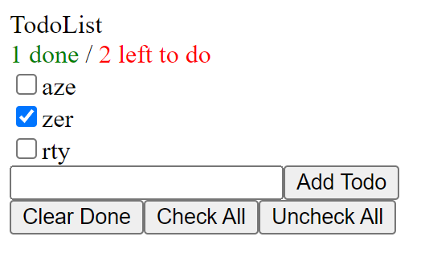

# EXERCICES

A partir du code du dossier **todo-list-1**, réalisez les actions suivantes :

## 1 - Créez un composant TodoListComponent

>Regoupez le code dans un composant **TodoListComponent** et importez-le dans **App**.

## 2 - Découpez TodoListComponent

Découpez **TodoListComponent** en :

>- un composant **TodoList** affichant la liste des todos
>- un composant **TodoForm** comprenant l'input et le bouton *Add Todo*
>- un composant **TodoActions** comprenant le bouton *Clear Done*
>- un composant **TodosStates** affichant le nombre de todos réalisées (checked) et le nombre de todos non réalisées

## 3 - Ajoutez des fonctionnalités

>- Ajoutez un bouton *Check All* permettant de cocher toutes les todos
>- Ajoutez un bouton *Uncheck All* permettant de décocher toutes les todos
  

## 4 - Utilisez Context

Pour éviter le *"Props pilling"* qui se produit lors de la remontée de données depuis les composants enfants vers leurs parents, on peut utiliser l'API Context...[useContext in 2 Minutes](https://www.youtube.com/watch?v=_HdrLsyAdJg).

> Adaptez votre code en utilisant cette Api.
